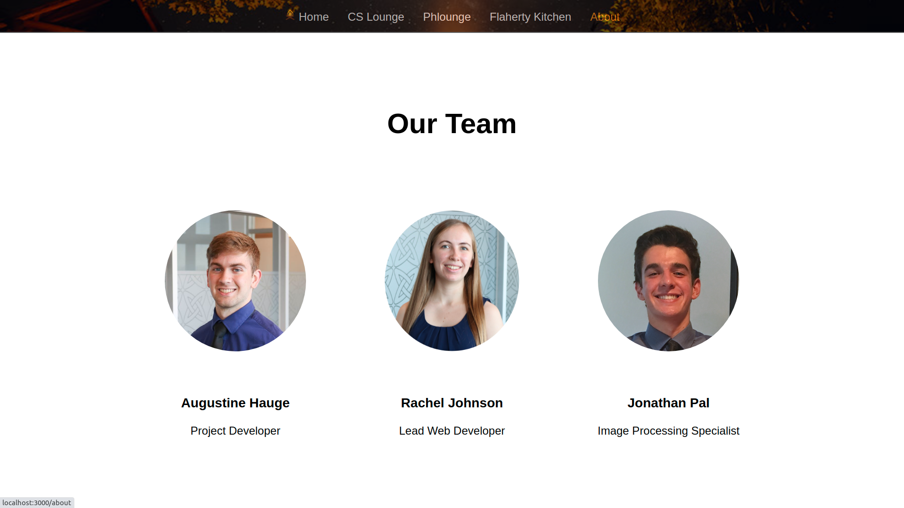

# Campfire
Campfire brings people together and eliminates food waste through a system of food cameras that allow people to easily share leftover food. 

# Inspiration
We looked for ways to bring people together and realized that when it comes to connections there’s nothing that brings people closer together than food. Inspired by [MIT's food cam](http://foodcam.media.mit.edu/view/view.shtml), we decided to build a system of food cameras that allow users to share leftover food with their communities.

# What it does
Users can view the food cameras for each community that they are a member of. Once signed in, they can easily check each location to see what food is available and how long each item has been there. This allows communities to build connections and eliminate food waste by safely sharing food. 

# How we built Campfire
We built the front end of the website using ReactJS, HTML, and CSS. The backend and image processing was done using Python and the OpenCV machine learning libraries. 

# Challenges we ran into
We had trouble identifying individual objects with the general computer vision models already available, but we fine tuned the parameters to work relatively well for simple objects and we plan to develop a custom model as we collect more data. 

# Accomplishments
This was our first time working with React, so we are proud of the multi-page web app that we developed. This was also our first time working with OpenCV, and we are proud that we were able identify individual objects relatively well given the limitations of a fairly generic algorithm like the Canny Edge Detector.

# What's next for Campfire
Our next step is to install 24/7 camera stations in dorm kitchens and community lounges so that data can be continually shared in real time. We also plan to develop a neural network to more precisely identify and track objects once sufficient data is collected to train a network.
